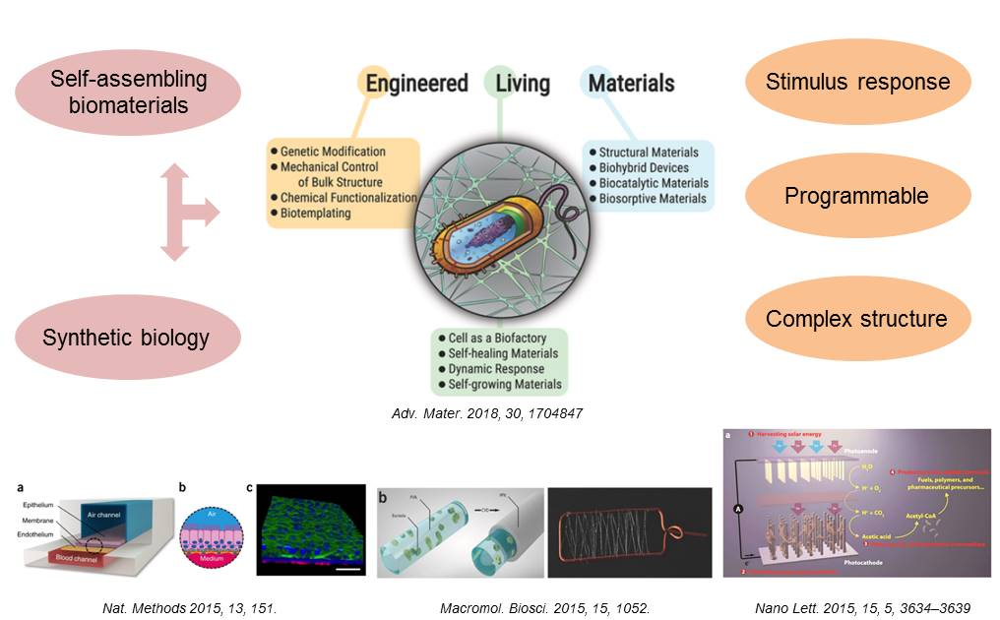
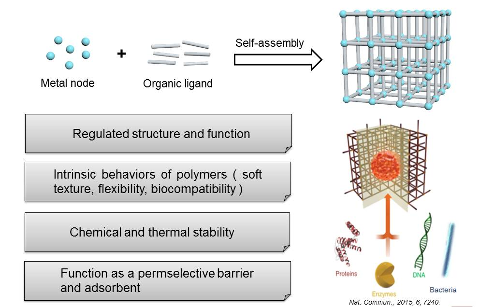

## 康安琪 (Agatha)

2014.10 ~ 2018.06 [东北大学](http://www.neu.edu.cn/) 本科 应用化学.

2018.09 ~ 2021.06 [上海科技大学](https://www.shanghaitech.edu.cn/) 硕士 材料科学与工程.

### 研究方向

以金属有机框架（MOF）和可基因编辑的细菌为基础，制备对外界环境有所响应的living material.

```markdown

1.工程活体材料：由无机或有机材料与可进行基因编辑的微生物或细胞构成，具有结构复杂、可工程和对外界环境有所响应的优点，被应用于模拟血管、呼吸道，以及药物缓释和人工光合等领域.

```


```markdown

2. 金属有机框架：简称MOFs，是由有机配体和金属离子或团簇通过配位键自组装形成的具有分子内孔隙的有机-无机杂化材料;目前，已有封装蛋白质，酶等研究，对生物大分子起到保护和辅助发挥功能的作用.

```


[更多信息见课题组网站](http://isynbio.siat.ac.cn/zhonglab/).

### 爱好

羽毛球、游泳和单车，擅长绘画，爱看纪录片，最喜欢的美食博主是 [绵羊料理](https://space.bilibili.com/18202105). 

### 自我评价

喜欢有挑战的事情，一直在突破自己，对生活充满热情，对未来抱有期待.

感谢您的阅读！


2020.09.25
